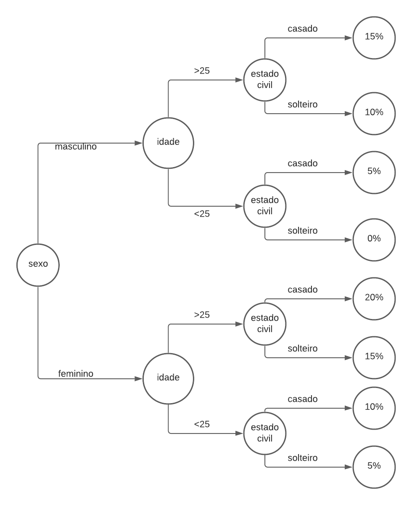
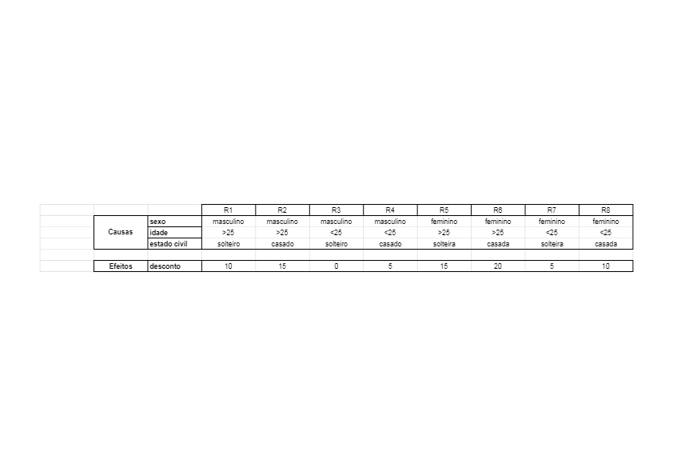

## Tarefa 005 - 08/02/2022 - Grafo de Causa e Efeito / Tabela de Decisão.

1.Considere o seguinte cenário: Uma corretora de seguros concede desconto sobre o prêmio anual de seguro de automóvel, aos seus segurados conforme as regras a seguir:
|Sexo|Idade (anos)|Estado Civil|Desconto (%)|
|---|---|---|---|
|Masculino|< 25|Solteiro|0|
|Masculino|< 25|Casado|5|
|Masculino|> 25|Solteiro|10|
|Masculino|> 25|Casado|15|
|Feminino|< 25|Solteira|5|
|Feminino|< 25|Casada|10|
|Feminino|> 25|Solteira|15|
|Feminino|> 25|Casada|20|

2. Solicita-se:

   1. Geração do grafo de causa e efeito para representar este cenário.
      1. Anexar a este arquivo a imagem do grafo.
         
   2. Geração da tabela de decisão para representar o cenário.
      1. Editar este arquivo e adicionar a tabela de decisão.
         
   3. Geração do conjunto de casos de teste suficientes para cobrir todos os cenários, constantes do grafo e da tabela de decisão.

      1. Editar este arquivo e adicionar a tabela com os casos de teste, conforme exemplos disponibilizados em tarefas anteriores.

      | Casos de teste | Cenário                  | Desconto esperado | Resultado esperado | Conformidade |
      | -------------- | ------------------------ | ----------------- | ------------------ | ------------ |
      | CT01           | Homem <25 anos solteiro  | 0                 | R$ 2000.00         |              |
      | CT02           | Homem <25 anos casado    | 5                 | R$ 1900.00         |              |
      | CT03           | Homem >25 anos solteiro  | 10                | R$ 1800.00         |              |
      | CT04           | Homem >25 anos casado    | 15                | R$ 1700.00         |              |
      | CT05           | Mulher <25 anos solteira | 5                 | R$ 1900.00         |              |
      | CT06           | Mulher <25 anos casada   | 10                | R$ 1800.00         |              |
      | CT07           | Mulher >25 anos solteira | 15                | R$ 1700.00         |              |
      | CT08           | Mulher >25 anos casada   | 20                | R$ 1600.00         |              |

   4. Em relação aos casos de teste, considere o valor do seguro de R$ 2.000,00 (Dois mil reais). Desta forma, o valor esperado, do resultado do caso de teste, deve ser o valor líquido a ser pago. Ou seja, o prêmio deduzido do valor correspondente ao percentual do desconto obtido pelo cliente.
      INSTRUÇÕES:

1. Tipo: Tarefa Individual;
1. Local de Entrega: Repositório pessoal, no github. O arquivo a ser entregue é este mesmo, editado com a inclusão dos dados solicitados.
1. Data da Entrega: 14/02/2022, as 23h59min.
1. Critério de Aceitação: Arquivo entregue com os dados solicitados.
