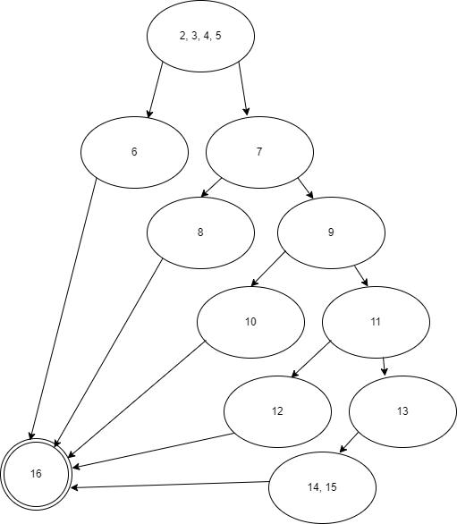

## Tarefa 006 - 15/02/2022 - Grafo de Fluxo de Controle

1. Considere o fragmento de código implementado na Linguagem de Programação Java.

```java

public class Avaliacao {


1    public String avalia(double nota1, double nota2, int faltas, int cargaHoraria) throws ValoresInvalidosException{
2        String result;
3        double percentualFaltas = (faltas*100/cargaHoraria);
4        double media = (nota1 + nota2)/2;
5        if((nota1 < 0.0 || nota1 > 10) || (nota2 < 0.0 || nota2 > 10) || (faltas < 0 || faltas > cargaHoraria) || cargaHoraria < 0){
6            throw new ValoresInvalidosException();//result = "Valores Inválidos.";
7        }else if(percentualFaltas > 25.0){
8            result = "Reprovado por Falta.";
9        }else if(media < 3.0){
10            result = "Reprovado por Média.";
11        }else if(media >= 3.0 && media < 6.0){
12            result = "Prova Extra.";
13        }else{
14            result = "Aprovado.";
15        }
16        return result;
17    }
18 }
```

2. Pede-se:

   1. Desenhar o **Grafo do Fluxo de Controle**. Pode-se anexar a imagem, aqui neste arquivo.
      
   2. Calcular a complexidade ciclomática do código. Exemplo de coo calcular pode ser obtido no [link](https://www.treinaweb.com.br/blog/complexidade-ciclomatica-analise-estatica-e-refatoracao)

   ```
   V(G) = E  - N+2
   V(G) = 14 - 10+2
   V(G) = 2
   ```

   3. Definir quantos caminhos de execução existem;

   ```
   05 caminhos

   Caminho A:
    2,3,4,5 -> 6 -> 16
   Caminho B:
    2,3,4,5 -> 7 -> 8 -> 16
   Caminho C:
    2,3,4,5 -> 7 -> 9 -> 10 -> 16
   Caminho D:
   2,3,4,5 -> 7 -> 9 -> 11 -> 12 -> 16
   Caminho E:
   2,3,4,5 -> 7 -> 9 -> 11 -> 13 -> 14,15 -> 16
   ```

   4. Definir os casos de teste necessários para se percorrer todos estes caminhos. Cada caso de teste deve ter o valor correspondente para cada variável de entrada e o valor esperado.

   | CT  |                                           Ação                                            |          Resultado Esperado          | Status |
   | :-: | :---------------------------------------------------------------------------------------: | :----------------------------------: | :----: |
   | 01  | nota1 > 10 ou nota1 < 0 ou nota2 > 10 ou nota2 < 0 ou faltas < 0 ou faltas > cargaHoraria | TrowException() de valores inválidos |        |
   | 02  |                                   percentualFaltas > 25                                   |         Reprovado por Falta.         |        |
   | 03  |                           percentualFaltas >= 25 e media < 3.0                            |         Reprovado por Média.         |        |
   | 04  |                    percentualFaltas >= 25 e media >= 3.0 e media < 6.0                    |             Prova Extra.             |        |
   | 05  |                           percentualFaltas >= 25 e media >= 6.0                           |              Aprovado.               |        |

   INSTRUÇÕES:

1. Tipo: Tarefa Individual;
1. Local de Entrega: _branch main/master_ do repositório pessoal do aluno, criado para a manutenção do controle de versão dos artefatos da disciplina. O arquivo a ser entregue, pode ser este mesmo, editado com as respostas das questões solicitadas.
1. Data da Entrega: 21/02/2021, as 23h59min.
1. Critério de Aceitação: arquivo entregue, conforme solicitado.
